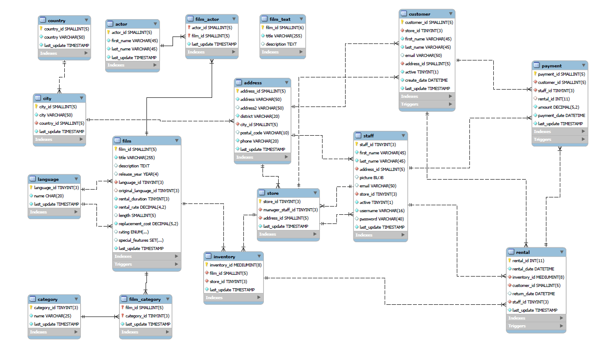

# Script-SQL-Sakila-MySQL
## Ejercitación Académica de SQL con Base de Datos Sakila

Este repositorio contiene una serie de scripts SQL que corresponden a ejercitación académica y tienen como objetivo demostrar habilidades con las sentencias SQL. Esta ejercitación se realizó en SQL utilizando la base de datos Sakila en MySQL Workbench.

## Objetivo

El propósito de este repositorio es demostrar los conocimientos obtenidos y habilidades en el uso de SQL a través de ejercicios prácticos sobre Funciones, Trigger, Stored Procedures,Transacciones, etc

## Esquema Sakila

